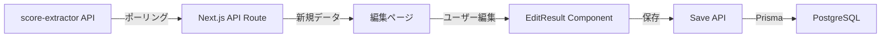

# 開発状況詳細 - 2025-06-22

## 🔧 現在の実装状況

### ✅ 完成しているコンポーネント

#### 1. EditResult コンポーネント (`web/src/components/edit-result/edit-result.tsx`)
- **機能**: スコア編集フォーム
- **特徴**:
  - リザルト画面モードと選曲画面モードの切り替え
  - React Hook Form + Zodによるフォーム管理
  - 各種判定数値の入力フィールド
  - パターン選択（シーケンシャル/ランダム）
  - ハザード選択（ノーマル/ハード/その他）

#### 2. MusicSelect コンポーネント (`web/src/components/edit-result/music-select.tsx`)
- **機能**: 楽曲選択のオートコンプリート
- **特徴**:
  - Commandパターンによる検索UI
  - 楽曲名でのフィルタリング
  - 選択後に難易度情報を自動取得
  - リアルタイムでの検索結果表示

#### 3. バリデーション (`web/src/application/result-validation.ts`)
- **実装済み検証**:
  - 必須フィールドチェック
  - 数値の範囲検証（0以上）
  - 楽曲コンボ数との整合性チェック
  - カスタムエラーメッセージ（一部日本語化済み）

### 🚧 未実装・課題

#### 1. ページレベルの実装
- `/results/edit` ページが存在しない
- score-extractorからのデータ受け取り方法が未定
- 保存後の遷移先が未定

#### 2. API統合
- score-extractor API (`http://localhost:8080/api/v1/scores`) との連携未実装
- データ保存用のAPIエンドポイントがない
- 認証を考慮したデータ保存フローが未実装

#### 3. UI/UX改善
- 画像表示機能（元のスクリーンショット表示）
- エラーメッセージの完全な日本語化
- ローディング状態の表示
- 保存成功/失敗のフィードバック

## 📊 データフロー設計（案）



## 🗄️ データベース構造（現状）

### Result テーブル
```prisma
model Result {
  id            String   @id @default(cuid())
  userId        String
  musicId       String
  chartId       String
  playMode      PlayMode
  scoreImageUrl String?
  score         Int
  scoreRate     Float
  
  // 判定データ
  justReflecBest Int
  justReflec     Int
  just           Int
  attack         Int
  miss           Int
  
  combo         Int
  hazard        HazardType
  pattern       PatternType
  resultType    ResultType
  
  createdAt     DateTime @default(now())
  updatedAt     DateTime @updatedAt
}
```

## 🔍 技術的な決定事項

### フォーム管理
- React Hook Form v7を採用
- Zodによるスキーマバリデーション
- フィールドレベルのエラー表示

### UI コンポーネント
- shadcn/ui (Radix UI + Tailwind CSS)
- カスタムコンポーネントは `src/components/ui/` に配置
- ダークモード対応を前提とした設計

### 状態管理
- サーバー状態: TanStack Query
- フォーム状態: React Hook Form
- グローバル状態: 現時点では不要

## 📝 次のステップの詳細

### 1. 編集ページの作成
```typescript
// app/results/edit/page.tsx
- score-extractorからのデータ取得
- EditResultコンポーネントの配置
- 保存処理の実装
```

### 2. API Routes の実装
```typescript
// app/api/results/save/route.ts
- POSTメソッドでデータ受信
- 認証チェック
- Prismaによるデータ保存
- エラーハンドリング
```

### 3. score-extractor連携
```typescript
// lib/score-extractor-client.ts
- APIクライアントの作成
- ポーリング機能
- データ変換処理
```