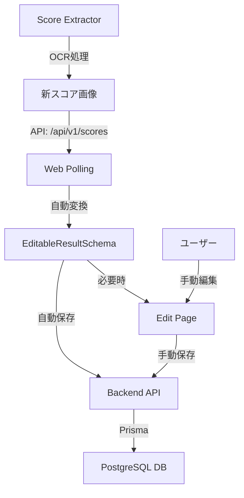

# ポーリングからDB保存への設計分析

## 🔍 現在の実装状況

### 既存のポーリング実装

#### 1. `use-polling.ts` - 基本ポーリングHook
```typescript
export const usePolling = ({ duration, onFetchData }: PollingProps): void => {
  useEffect(() => {
    const interval = setInterval(async () => {
      const data = await fetchResult();
      if (data.length > 0) {
        onFetchData(data);
      }
    }, duration ?? 3000);
    return () => clearInterval(interval);
  });
};
```

**特徴:**
- 3秒間隔で `fetchResult()` を実行
- `localhost:6433/api/v1/scores` (score-extractor) からデータ取得
- 新しいデータがあれば `onFetchData` コールバック実行

#### 2. `api-client.ts` - データ取得・変換
```typescript
export const fetchResult = async (since?: Date): Promise<EditableResultSchema[]> => {
  const url = new URL("/api/v1/scores", "localhost:6433");
  if (since) {
    url.searchParams.set("since", since.toISOString());
  }
  const response = await fetch(url.toString());
  const result = await response.json();
  return result.map(convertResultFromFetchData);
};
```

**特徴:**
- score-extractor API から生データ取得
- `convertResultFromFetchData` で Web UI の形式に変換
- `since` パラメータで差分取得可能

#### 3. 現在の問題点
- ✅ データ取得: score-extractor から正常に取得
- ✅ データ変換: `EditableResultSchema` 形式に変換済み
- ❌ データ保存: 取得したデータが **DB に保存されていない**
- ❌ 重複実装: `results/edit/page.tsx` で別のポーリング実装

## 💡 設計概念

### データフロー設計



### 保存戦略の選択肢

#### A. 完全自動保存（推奨）
- ポーリングで取得したデータを **即座に DB 保存**
- ユーザーは後から編集・修正可能
- 利点: データ損失なし、ユーザー負荷軽減

#### B. 半自動保存
- ポーリングで取得したデータを **一時保存**
- ユーザーが確認後に DB 保存
- 利点: データ精度向上、ユーザー制御

#### C. 手動保存のみ
- 現在の `results/edit` と同じ
- 利点: ユーザー完全制御

## 🎯 推奨アプローチ: 完全自動保存

### 理由

1. **ユーザビリティ**: ゲームプレイ中に保存を気にする必要がない
2. **データ完全性**: OCR 結果を確実に記録
3. **効率性**: 後から一括で編集・修正可能
4. **スケーラビリティ**: 大量スコアの自動処理

### 実装方針

#### 1. 自動保存ポーリング Hook
```typescript
export const useAutoSavePolling = () => {
  const lastFetchTime = useRef(new Date());
  
  useEffect(() => {
    const interval = setInterval(async () => {
      // 差分取得で効率化
      const newResults = await fetchResult(lastFetchTime.current);
      
      if (newResults.length > 0) {
        // 自動的にDB保存
        await saveResultsToDatabase(newResults);
        lastFetchTime.current = new Date();
      }
    }, 5000); // 5秒間隔
    
    return () => clearInterval(interval);
  }, []);
};
```

#### 2. バッチ保存 API
```typescript
// POST /api/results/batch-save
export async function POST(request: NextRequest) {
  const results: EditableResultSchema[] = await request.json();
  
  // トランザクションで一括保存
  await prisma.$transaction(async (tx) => {
    for (const result of results) {
      await saveOrUpdateResult(tx, result);
    }
  });
}
```

#### 3. 重複処理戦略
- **Primary Key**: `(userId, musicId, type, difficulty, playedAt)`
- **Upsert 処理**: 既存レコードは更新、新規は作成
- **バージョン管理**: `updatedAt` で最新性確認

## 📋 実装タスク

### Phase 1: 自動保存基盤
1. **バッチ保存 API 作成** (`/api/results/batch-save`)
   - 複数の `EditableResultSchema` を一括処理
   - トランザクション処理でデータ整合性確保
   - 重複チェック・Upsert ロジック

2. **自動保存 Hook 作成** (`useAutoSavePolling`)
   - 既存 `use-polling.ts` を拡張
   - 差分取得による効率化
   - エラーハンドリング・リトライ機能

3. **保存状態管理**
   - 保存成功・失敗のステート管理
   - UI での保存状況表示
   - 失敗時の再試行機能

### Phase 2: UI 統合
1. **グローバル自動保存**
   - アプリケーション全体で自動保存を有効化
   - `layout.tsx` で `useAutoSavePolling` 実行

2. **保存状況の可視化**
   - 画面上部に保存ステータス表示
   - 「自動保存: 有効」「最終保存: 2分前」等

3. **既存編集機能との統合**
   - 自動保存されたデータの編集機能
   - 編集履歴・版管理

### Phase 3: 運用最適化
1. **パフォーマンス最適化**
   - ポーリング間隔の動的調整
   - バックグラウンド処理での保存

2. **エラー処理**
   - ネットワーク断線時の処理
   - DB 接続エラー時の一時保存

3. **監視・ログ**
   - 保存成功率の監視
   - エラーログの収集

## 🔧 技術詳細

### 自動保存のトリガー条件
1. **新規スコア検出**: score-extractor API で新データ
2. **時間間隔**: 5秒間隔での定期チェック
3. **差分取得**: `since` パラメータで効率化

### データ変換・検証
1. **OCR データ → EditableResultSchema**: 既存の変換ロジック活用
2. **バリデーション**: `result-validation.ts` でデータ検証
3. **エラー処理**: 不正データは警告ログ出力、保存スキップ

### 重複・競合処理
1. **Primary Key 設計**: `(userId, musicId, type, difficulty, playedAt)`
2. **Upsert 戦略**: 既存データの更新 vs 新規作成
3. **楽観的ロック**: `updatedAt` による競合検出

---

## 🚀 期待効果

### ユーザー体験
- ❌ 手動保存の手間
- ✅ 自動的なデータ蓄積
- ✅ ゲームプレイに集中可能

### データ管理
- ❌ 保存忘れによるデータ損失
- ✅ 完全なスコア履歴
- ✅ 後からの編集・分析可能

### システム運用
- ✅ 安定した自動処理
- ✅ エラー処理・復旧機能
- ✅ スケーラブルな設計

この設計により、OCR から DB 保存までの完全自動化が実現できます。